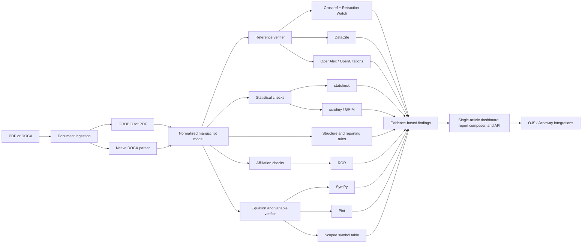
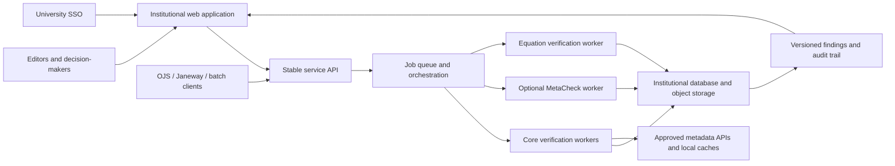

# Open Integration Stack Proposal

_Discussion draft - last reviewed 22 July 2026_

> **Scope note:** This proposal describes the target architecture for the full institutional service (Phase B and beyond in [project-plan.md](project-plan.md#architekturbereitstellung)) — a centrally operated, multi-tenant, role-based platform. The current MVP (Phase A, Stufe 0/1) is a local, single-user PySide6 application with no server and no equation/statistics checks; see [project-plan.md](project-plan.md#mvp-reference-checker) and its [Stufenmodell](project-plan.md#stufenmodell-zur-risikominimierung) for what's actually in scope now and what gates each later capability. Where this document recommends "local mirrors or caches" as a general default (e.g. for Crossref/OpenAlex/Retraction Watch), note that `project-plan.md` already concluded, with cited scale figures, that full self-hosting of Crossref/OpenAlex is **not practical for the MVP** (OpenAlex snapshot: hundreds of GB to low TB; Crossref Public Data File: ~200 GB) and that no maintained self-hostable proxy currently exists — treat "local mirror" as a Phase B option to re-evaluate once a server exists, not a near-term default.

## Purpose

This proposal identifies openly available components that could be integrated into the Manuscript Verification System. It prioritizes useful checks, explainable evidence, institutional self-hosting, licensing compatibility, and realistic implementation effort. The proposed scope includes equation consistency and verification that mathematical variables are defined.

## Product posture and primary users

The system should be an institutional decision-support service, not only a researcher-facing manuscript checker. Its primary users are:

- Journal editors and editorial-board members
- Journal managers and university publishing services
- Research-integrity officers and investigation teams
- University research offices, libraries, and quality-assurance teams
- Institutional administrators responsible for policy, privacy, and operations

Authors and reviewers remain important secondary users, with views tailored to remediation and expert review. Automated findings should inform decisions but never produce an unreviewed accept, reject, misconduct, or quality decision.

The reference deployment is a centrally operated service on university IT infrastructure. Manuscripts and detailed findings remain under institutional control, while outbound calls to scholarly metadata services disclose only the minimum identifiers or bibliographic fields required for a check.

## Recommended core integrations

| Priority | Component | Role in the system | Integration approach | Main caveat |
|---|---|---|---|---|
| 1 | [GROBID](https://grobid.readthedocs.io/en/latest/) | Extract manuscript sections, references, citation callouts, authors, affiliations, figures, tables, and declarations from PDFs | Run locally as a Dockerized REST service; retain TEI XML plus page coordinates as the canonical parsed representation | PDF extraction is imperfect; DOCX needs a separate parser. The full image is approximately 8 GB. Already benchmarked as Tier 1 in this project — see [project-plan.md](project-plan.md#technischer-stack-mvp) |
| 1 | [Crossref REST API](https://www.crossref.org/documentation/retrieve-metadata/rest-api/) | Resolve references and compare titles, authors, journal, year, and DOI metadata | Query by DOI first, then bibliographic search; cache normalized results and confidence | Missing metadata must produce `unverified`, not `invalid`. Full local self-hosting is not practical for the MVP — see scope note above |
| 1 | [Retraction Watch via Crossref](https://www.crossref.org/documentation/retrieve-metadata/retraction-watch/) | Detect retractions, expressions of concern, corrections, and reinstatements | Use Crossref's production API or mirror its downloadable dataset locally (Phase B option — see scope note above) | Corrections and expressions of concern are less comprehensive than retractions |
| 1 | [DataCite REST API](https://support.datacite.org/docs/api) | Validate references to datasets, software, preprints, and repository objects | Use as a fallback or complement when Crossref cannot resolve a DOI | Metadata quality varies by depositor |
| 2 | [ROR](https://ror.readme.io/docs/rest-api) | Normalize affiliations and identify nonexistent, obsolete, or mismatched institutions | Match extracted affiliation strings to ROR records; retain candidates and confidence | Do not automatically label unmatched affiliations as fraudulent |
| 2 | [statcheck](https://cran.r-project.org/web/packages/statcheck/index.html) | Recalculate reported p-values and flag internal inconsistencies | Wrap the R package in an isolated R worker or microservice | Only recognizes supported tests reported in APA-like formats; GPL-3 requires a licensing review. Not in current MVP scope |
| 2 | [SymPy](https://www.sympy.org/) | Parse equations and perform symbolic, algebraic, and domain checks | Run as a local Python verification service against normalized mathematical expressions | LaTeX parsing is experimental and mathematical notation can be ambiguous. Not in current MVP scope |
| 2 | [Pint](https://pint.readthedocs.io/) | Check unit and dimensional consistency | Associate extracted variable units with symbols and evaluate dimensions on both sides of an equation | Requires reliable extraction or declaration of units. Not in current MVP scope |

GROBID is particularly attractive because it is Apache-2.0 licensed, self-hostable, and already supports Crossref consolidation through its API. It gives the verification pipeline a common structured input instead of forcing every checker to parse the original PDF independently. See the [GROBID service documentation](https://grobid.readthedocs.io/en/latest/Grobid-service/).

## MetaCheck integration strategy

[MetaCheck](https://www.scienceverse.org/metacheck/) is both the closest open-source competitor and a potential optional worker. It already combines GROBID ingestion with statistical, reporting, reference, open-practice, repository, and code checks. Its modular structure and validation-oriented reporting align closely with this project's principles.

Any independent implementation of overlapping functionality must follow the [Clean-room Development Policy](clean-room-development-policy.md). Benchmarking may use documented interfaces and observable outputs, but competitor source, tests, prompts, regular expressions, fixtures, templates, and internal schemas must not enter the implementation process. Licensed integration is a separate route that requires an explicit project decision and AGPL review.

The recommended approach is initially hybrid:

- Keep the normalized manuscript model, public service API, finding schema, editor workflow, equation engine, and institutional audit model independent.
- Evaluate a pinned MetaCheck release in an isolated R container.
- Consider importing selected modules for open-practice, COI, funding, preregistration, power, effect-size, repository, code, and replication checks.
- Avoid duplicating reference lookups when our core Crossref, DataCite, OpenAlex, and Retraction Watch services already provide normalized evidence.
- Translate MetaCheck output into the common finding schema rather than exposing package-specific objects to the rest of the system.
- Review AGPL-3.0-or-later obligations before deployment, modification, redistribution, or tighter code-level integration.

MetaCheck should not become a mandatory runtime dependency until its interfaces, operational behavior, and finding quality have been benchmarked on representative manuscripts.

### MetaCheck benchmark decision gate

Run a benchmark before deciding whether to adopt, wrap, collaborate on, or independently implement overlapping checks. The detailed protocol is maintained separately, as project planning material; it is a distinct and much larger effort from the already-executed reference-extraction Tier 0–3 benchmark, and its LLM tracks are gated behind Phase B/Stufe 3 approval.

The decision gate should compare:

- Detection coverage by check category
- Precision, recall, false-positive rate, and false-negative rate against manually reviewed ground truth
- Quality, specificity, and actionability of evidence shown to editors
- PDF, DOCX, and disciplinary robustness
- Runtime, memory, external calls, failure isolation, and batch throughput
- Ease of mapping outputs into the common finding schema
- Deployment, maintenance, versioning, privacy, and licensing burden

The initial corpus should contain at least 50 manuscripts spanning multiple disciplines, document formats, equation density, statistical reporting styles, and known issue types. Evaluation should be conducted at finding level rather than by comparing aggregate manuscript scores.

## Equation and variable verification

> Not in current MVP scope (see [project-plan.md](project-plan.md#mvp-reference-checker)) — retained here as the second-phase design for when equation/variable verification is separately approved.

### Intended checks

The equation module should provide bounded, explainable checks rather than claim to prove that a scientific model is correct. It should check:

- Whether every equation can be parsed syntactically
- Whether every variable is defined in the manuscript or in an explicitly recognized standard notation set
- Whether a variable is used before it is defined
- Whether one symbol receives conflicting definitions in the same scope
- Whether a definition is never used
- Whether subscripts, superscripts, bold symbols, Greek symbols, and similarly rendered characters are used consistently
- Whether equation numbering and in-text equation references resolve
- Whether both sides of an equation have compatible physical dimensions when units are available
- Whether an explicitly stated algebraic transformation is symbolically equivalent to the previous expression
- Whether obvious domain problems exist, such as division by zero or logarithms and square roots with incompatible stated assumptions

### Extraction strategy

Use the richest available source representation in this order:

1. **LaTeX source:** preserve the original mathematical markup and equation labels.
2. **DOCX:** extract Office Math Markup Language (OMML) directly and convert it into the system's normalized mathematical representation. A separately deployed [Pandoc](https://pandoc.org/) conversion worker can be evaluated as an optional normalizer, subject to its GPL-2-or-later licensing requirements.
3. **JATS or MathML:** ingest structured mathematical markup directly when publishers provide it.
4. **PDF:** use GROBID to locate displayed formula blocks and their page coordinates. GROBID does not currently serialize inline formulas or super/subscript information reliably enough to serve as the only equation parser.
5. **Rendered-equation fallback:** crop equation regions and run the MIT-licensed [pix2tex / LaTeX-OCR](https://github.com/lukas-blecher/LaTeX-OCR) locally. OCR-derived equations must carry lower confidence and remain visible for human comparison with the source image.

PDF equation OCR should be a fallback, not the default. A single misread exponent, minus sign, or subscript can invalidate every downstream check.

### Normalized equation model

Each extracted equation should retain:

- Original markup or image crop
- Normalized MathML or abstract syntax tree
- Displayed and canonical symbol forms
- Equation number and document location
- Extraction method and confidence
- Links to surrounding paragraphs
- Assumptions, units, domains, and definitions associated with each symbol

The system should build a scoped symbol table. A symbol definition applies within a document, section, subsection, or equation block according to explicit rules. Definition extraction should recognize patterns such as "where x denotes...", "let n be...", parenthetical definitions, notation tables, and glossary entries.

### Open components

| Component | Proposed use | License and caution |
|---|---|---|
| [SymPy](https://docs.sympy.org/latest/modules/parsing.html) | Convert normalized expressions to symbolic trees, simplify differences, compare explicit transformations, and inspect free symbols and domains | BSD; LaTeX parsing is explicitly experimental, so parser failures must not be reported as equation errors |
| [Pint](https://pint.readthedocs.io/) | Represent units and test dimensional compatibility | BSD-3-Clause; depends on accurate unit-to-variable association |
| [GROBID formula coordinates](https://grobid.readthedocs.io/en/latest/Coordinates-in-PDF/) | Locate displayed formulas in PDFs and connect findings to source pages | Apache-2.0; formula text loses important formatting detail |
| [pix2tex](https://github.com/lukas-blecher/LaTeX-OCR) | Convert cropped equation images to candidate LaTeX when structured math is unavailable | MIT; model output must be treated as uncertain OCR evidence |
| [Pandoc](https://pandoc.org/) | Optional isolated conversion between DOCX/OMML, LaTeX, MathML, and other structured formats | GPL-2-or-later for the executable; deployment and redistribution model require review |

### Finding examples

- `EQUATION_PARSE_FAILED`: equation could not be converted into an unambiguous syntax tree
- `VARIABLE_UNDEFINED`: symbol appears in an equation but no definition was found in scope
- `VARIABLE_USED_BEFORE_DEFINITION`: definition occurs only after first use
- `VARIABLE_REDEFINED`: incompatible definitions were found in the same scope
- `VARIABLE_STYLE_INCONSISTENT`: for example, `x`, **x**, and `x_i` may have been conflated
- `DIMENSION_MISMATCH`: left- and right-hand sides have incompatible dimensions
- `TRANSFORMATION_NOT_EQUIVALENT`: two expressions explicitly presented as equivalent do not simplify to the same result under recorded assumptions
- `EQUATION_REFERENCE_BROKEN`: an equation callout has no matching label, or a label is duplicated

All equation findings must show the original expression, normalized interpretation, source location, assumptions used, and extraction confidence.

### Explicit limitation

The system can detect internal mathematical inconsistencies, missing definitions, and some invalid transformations. It generally cannot establish that an equation correctly models the real-world phenomenon, that all premises are scientifically justified, or that a novel proof is valid. Such cases remain expert-review tasks.

## Valuable second-phase integrations

### OpenAlex

Use [OpenAlex](https://developers.openalex.org/api-reference/introduction) to enrich resolved references with:

- Retraction indicators
- Citation relationships
- Author and institution identifiers
- Topic and journal information
- DOI, PMID, and PMCID mappings

This could support warnings such as "reference metadata disagrees across registries" or "cited work is marked retracted." OpenAlex should be a secondary source rather than the sole authority. Its data remain free, but the hosted API uses a freemium quota; bulk operations should use caching or the free snapshot. See the [OpenAlex pricing documentation](https://developers.openalex.org/guides/authentication).

### OpenCitations

[OpenCitations](https://opencitations.net/querying/) provides CC0 citation data through REST and SPARQL APIs. Suitable uses include:

- Confirming citation links
- Identifying citation concentration
- Producing citation-network evidence
- Checking whether references are isolated from or connected to relevant literature

It should not independently classify citation patterns as misconduct.

### scrutiny / GRIM

The open [`scrutiny`](https://search.r-project.org/CRAN/refmans/scrutiny/html/grim.html) package can detect means or percentages that are mathematically incompatible with a reported sample size.

Add this after table extraction is reliable. Unlike `statcheck`, GRIM requires the system to correctly associate a value with its sample size and measurement structure. Extraction errors could otherwise create many false positives.

### ORCID

ORCID is useful when authors supply ORCID iDs voluntarily:

- Verify that the identifier resolves
- Compare the submitted name with public record data
- Confirm authenticated ownership during submission

Avoid fuzzy-searching ORCID and claiming that a person's identity has been verified. The free Public API is restricted to non-commercial use; a revenue-generating deployment would require an appropriate ORCID arrangement. See the [ORCID Public API terms](https://info.orcid.org/public-client-terms-of-service/).

### OJS and Janeway

Treat [Open Journal Systems](https://openjournalsystems.com/ojs-3-user-guide/editorial-workflow-overview/) and [Janeway](https://janeway.systems/pages/our-story.html) as distribution channels:

1. A plugin sends a submitted manuscript to the verification API.
2. The API returns a structured report.
3. Editors inspect evidence and override findings.
4. The final result is stored in the editorial audit trail.

These adapters should be built only after the standalone verification API is stable.

## University-hosted service requirements

### User and decision workflow

- Role-based access for editors, journal managers, reviewers, integrity officers, auditors, and administrators
- Institution and journal-specific policy packs, thresholds, and enabled checks
- Triage queues, assignment, comments, escalation, resolution, and override reasons
- Separation between automated findings and human decisions
- Versioned reports that preserve which rules, models, data sources, and software versions produced each finding
- Portfolio and operational dashboards for authorized decision-makers without reducing manuscripts to a single quality score

### Single-article dashboard and interactive report composer

The dashboard covered by this feature is scoped to one article at a time. It should present the article, all generated findings, supporting evidence, and available visualizations in a workspace where an authorized user composes a report by selecting individual items.

The article dashboard should support:

- An article outline and evidence viewer linked to pages, paragraphs, tables, figures, equations, citations, references, and declarations
- Filtering findings by category, severity, confidence, review status, and manuscript location
- Selecting or excluding individual findings independently of whether the originating check module is included
- Selecting relevant visualizations, such as finding summaries, a manuscript issue map, citation-resolution status, statistical consistency summaries, or an equation-variable relationship view
- Reordering selected findings and visualizations and grouping them into report sections
- Previewing the composed report while retaining a route back to the underlying evidence
- Adding reviewed annotations and decisions without editing the original automated result
- Creating audience-specific variants for editors, authors, reviewers, or auditors from the same article record
- Saving a draft selection and generating an immutable report version after approval

Selection and review state must remain separate from detection state. Excluding an item from a particular report must not delete or silently alter the finding. Store the finding identifier, visualization identifier and parameters, inclusion state, order, section, audience, annotation, decision or exclusion reason, actor, and timestamp. A generated report must also record the manuscript version, policy pack, check configuration, rules, models, external-data versions, software versions, generator identity, and generation time.

Supported outputs should include accessible HTML and PDF for people plus JSON and a stable machine-readable audit representation. A report should reproduce the selected content and visualization parameters exactly, even after later checks or reviews change the live article workspace.

MetaCheck documents a Shiny report application and a `report()` function that can run a selected vector of modules and generate QMD, HTML, or PDF reports. Module-level selection and basic interactive HTML display are therefore feature parity. The potential differentiation is post-run, item-level selection of individual findings and visualizations, visual arrangement and preview, audience-specific variants, and an auditable record of inclusion and exclusion decisions. This assessment is based on [MetaCheck's public introduction](https://www.scienceverse.org/metacheck/articles/metacheck.html), [report documentation](https://www.scienceverse.org/metacheck/reference/report.html), and [package index](https://www.scienceverse.org/metacheck/reference/index.html) as reviewed on 22 July 2026. It must be verified in the black-box benchmark and should not be stated as a confirmed absence in MetaCheck.

### Interfaces

- Accessible single-article dashboard with item-level finding and visualization selection
- Stable REST API for submission systems and institutional workflows
- Batch ingestion for research offices and metascientific evaluation
- OJS and Janeway adapters, with later connectors for commercial submission systems
- Exportable PDF, HTML, JSON, and machine-readable audit reports

### Identity and tenancy

- Institutional SSO through OpenID Connect or SAML/Shibboleth
- Multiple journals or organizational units within one institutional deployment
- Tenant-aware policy, access, storage, and reporting boundaries
- Delegated administration without granting central administrators routine access to manuscript content

### Privacy and security

- On-premises or institution-controlled cloud deployment
- Encryption in transit and at rest
- Configurable retention and secure deletion of manuscripts and derived artifacts
- Complete access and decision audit logs
- External-service allowlists and per-service disclosure documentation
- Local mirrors and caches for open metadata where practical
- No external LLM processing by default; any optional LLM use must be explicit, approved, and recorded
- No use of submitted manuscripts, reviewer reports, or findings for model training without a separately documented purpose, lawful basis, approval, and notice

### EU data, privacy, and AI compliance

Compliance with applicable EU and national law is a release requirement. The service must be designed around the GDPR principles of lawfulness, fairness, transparency, purpose limitation, data minimization, accuracy, storage limitation, integrity, and confidentiality. It must also assess obligations under the EU AI Act whenever AI-assisted modules are introduced.

At minimum, the institution must be able to:

- Document controller, joint-controller, and processor roles for each deployment and external service
- Record the purpose and lawful basis for processing authors, reviewers, editors, affiliations, manuscript content, usage data, and audit records
- Provide clear privacy information to affected people
- Configure retention, deletion, access, correction, export, restriction, and objection workflows
- Execute data-processing agreements and maintain a record of subprocessors
- Prevent international transfers unless an approved GDPR transfer mechanism and assessment are in place
- Conduct a Data Protection Impact Assessment when required and involve the institutional Data Protection Officer before production use
- Apply data protection by design and by default, including least privilege, tenant isolation, pseudonymization where possible, and minimum external disclosure
- Maintain incident response and personal-data breach notification procedures
- Keep final editorial and integrity decisions under meaningful human control; automated findings must not independently trigger rejection, sanctions, or misconduct conclusions
- Maintain an AI-system inventory and document intended purpose, provider/deployer roles, model and dataset provenance, accuracy, limitations, logging, transparency, human oversight, cybersecurity, and applicable AI Act classification
- Make AI use visible to users whenever EU transparency requirements apply

The detailed working checklist is maintained in [EU Data, Privacy, and AI Compliance Requirements](eu-data-privacy-compliance.md). It must be reviewed by the university's Data Protection Officer, legal counsel, information-security function, and, where relevant, ethics or research-integrity governance. The project documentation is not a substitute for legal advice.

### Operations

- Containerized services with a Docker Compose reference deployment for pilots
- Kubernetes or equivalent support for larger university installations
- Asynchronous job queue, retries, timeouts, and isolation of failing check workers
- Health checks, structured logs, metrics, backups, and upgrade procedures
- Pinned component versions and reproducible rule/model releases

## Proposed architecture

### Service deployment view

## Finding data model

Every finding should contain:

- Check identifier and version
- Severity and confidence
- Exact manuscript location
- Extracted value
- External evidence and retrieval date
- Plain-language explanation
- Human override and notes

## Integrations to defer

- **Open-source plagiarism detectors:** the limiting asset is the comparison corpus, not the matching algorithm.
- **General-purpose AI-text detectors:** false-positive risk is too high for an integrity decision.
- **Automated paper-mill accusations:** open metadata can provide signals, but not defensible conclusions.
- **Full image-manipulation detection:** basic within-document duplicate detection is feasible with OpenCV, but it will not match specialist products' reference corpora.
- **Zotero as a backend:** its retraction feature overlaps with this system, but Zotero is better treated as a future client or plugin.
- **Claims of general mathematical proof:** symbolic tools can verify bounded identities and transformations, but cannot automatically establish the scientific validity of arbitrary models or novel proofs.

## Initial recommendation

The recommended MVP stack is **GROBID + Crossref/Retraction Watch + DataCite + ROR + statcheck + SymPy + Pint**, supported by a locally developed, explainable rule engine, scoped symbol table, stable service API, and institutional review workflow. Structured equations from LaTeX, DOCX/OMML, JATS, or MathML should be supported first; PDF equation OCR should follow as a lower-confidence second phase.

MetaCheck should be benchmarked as an optional R worker during the MVP phase. The benchmark outcome will determine whether overlapping modules are adopted, wrapped, jointly developed upstream, or implemented independently.

This stack provides meaningful verification without depending on proprietary data or sending confidential manuscripts to third-party AI services. It is intended to run as a university-managed service for editors and institutional decision-makers while offering appropriately scoped feedback to authors and reviewers.

**Note on "MVP" above:** this section's use of "MVP" refers to this document's own longer-term stack proposal, not the actually-committed MVP in [project-plan.md](project-plan.md#mvp-reference-checker) (reference-checking only, local-first, no equation/statistics/LLM checks). Reconcile the two before treating this as the next implementation target — see the scope note at the top of this document.
