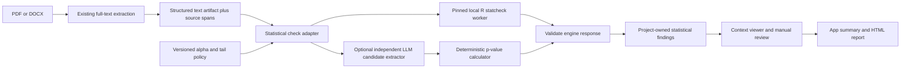

# Plan: Statistical Reporting Consistency Checks

**Created**: 2026-07-31
**Author**: Codex (GPT-5.6)

## Status

| Phase | Status | Date | Notes |
|-------|--------|------|-------|
| Spec | DONE | 2026-07-31 | Clean-room assessment; architecture review completed with blockers resolved |
| Plan | TODO | | Requires integration-route and deployment decisions |
| Phase 1: Statistical Finding Foundation | TODO | | Placeholder only |
| Ship | TODO | | |

## Spec

### Summary

**Motivation**: The app currently checks only references. Authors, reviewers, and editors would also benefit from a deterministic check for internally inconsistent null-hypothesis significance test (NHST) reports—for example, a reported p-value that does not agree with its test statistic and degrees of freedom. The CRAN `statcheck` package provides this narrow capability for completely reported APA-style correlations and t, F, chi-squared, Z, and Q tests.

**Outcome**: Add statistical-reporting consistency as an explicitly opt-in, evidence-based module after the reference MVP. It must be disabled by default, independently enableable by administrators, and selected deliberately for each run. The app should own ingestion, findings, context, human review, limitations, and report composition. One candidate engine is a pinned, isolated local R worker that receives text and invokes the documented `statcheck(texts, ...)` interface. A second candidate is an independently designed LLM-assisted extractor that can recognize a broader range of statistical reporting styles, followed by deterministic p-value recomputation. Adoption of either route is gated by a finding-level benchmark, privacy review, and the applicable licensing review. The module must never imply that an undetected or internally consistent result is statistically correct.

### Capability Assessment

The package's documented core behavior is:

- extract fully reported APA-style t, F, correlation, chi-squared, Z, and Q results from text;
- recompute p-values from the reported statistic and degrees of freedom;
- account for exact versus inequality reporting and rounding of test statistics;
- flag an internal inconsistency when reported and recomputed p-values disagree;
- separately flag a decision inconsistency when the reported and recomputed results fall on opposite sides of a configured alpha threshold;
- optionally assume one-tailed tests, or infer possible one-tailed use from document-wide keywords;
- optionally treat `p = .000` as an error;
- expose the reported statistic, degrees of freedom, reported p, computed p, raw extracted string, and flags per result;
- report the proportion of detected p-values that occurred in a complete APA-style result (`apa_factor`);
- summarize counts per source and create plots or an HTML report.

Documented limitations materially constrain the product claim:

- it usually misses results in tables and incomplete results;
- it is intentionally narrow and sensitive to reporting-style deviations;
- it does not establish which member of the reported number set is wrong;
- valid one-tailed tests, multiplicity corrections, corrected degrees of freedom, or other adjusted analyses can be flagged without adequate context;
- PDF-to-text conversion can create false positives and false negatives;
- the package authors estimate detection of roughly 60% of NHST results in typical psychology journals, while a recent independent critique argues that coverage is too narrow for the broad “statistical spellchecker” label;
- published high classification accuracy applies to results the tool extracted under studied settings, not to all statistical claims in a manuscript and not necessarily to this app's extraction pipeline.

### Recommended Feature Priorities

| Priority | Feature | Recommendation | Rationale |
|----------|---------|----------------|-----------|
| P0 | Roadmap correction | Replace the RegCheck reference with statcheck | `docs/project-plan.md` currently points the statistical-check extension at an unrelated registration-comparison tool. |
| P0 | Opt-in controls | Implement in our app | The module must be off by default, independently deployable, and explicitly selected per run; reference checking must not silently invoke statistical or LLM processing. |
| P0 | Statistical finding and evidence model | Implement in our app | The existing `ReferenceResult` cannot represent test statistics, source context, engine provenance, or separate human review. |
| P0 | Full-text source anchors | Implement in our app | Reviewers need the exact result plus surrounding manuscript context and a page/paragraph locator. |
| P0 | Explicit coverage and limitations | Implement in our app | “No inconsistency found” must not be confused with “all statistical results were checked.” |
| P0 | Human review states | Implement in our app | Corrected or one-tailed analyses require contextual judgement; automated output must remain separate from reviewer decisions. |
| P1 | Core `statcheck(text)` worker | Integrate after approval | Reuses a validated, maintained engine without duplicating its extraction and rounding behavior. |
| P1 | Independent LLM-assisted candidate extractor | Evaluate as an alternative or complementary engine | It may recognize tables, incomplete prose, non-APA notation, and more varied statistical reports, but recall, precision, structured-output fidelity, privacy, cost, and model dependence must be measured rather than assumed. |
| P1 | Deterministic statistical calculator | Implement independently if the LLM route is selected | The LLM should extract typed values and context; established distribution functions should recompute p-values so arithmetic consistency does not depend on model judgement. |
| P1 | Inconsistency and decision-inconsistency findings | Integrate into our finding schema | Decision inconsistencies deserve higher review priority but are not proof of an invalid conclusion. |
| P1 | Configurable alpha and `p = .000` policy | Implement as versioned run policy | Both materially affect classification and must be visible in provenance and reports. |
| P1 | Tail handling | Default to two-tailed; allow reviewed override | Document-wide keyword inference is too coarse to silently change individual results. Preserve any package inference as evidence, not fact. |
| P1 | Extracted-result inventory | Implement in our app | Show checked test type, df, statistic, reported p, recomputed p, and raw source text for auditability. |
| P1 | Statistical summary in report | Implement in our report system | Include extracted count, inconsistencies, decision inconsistencies, coverage caveats, policy, and reviewed decisions. |
| P2 | Reported-vs-computed p plot | Implement later if users need it | Useful for research or batch overview, less useful than item-level remediation for a single manuscript. |
| P2 | APA completeness indicator | Pilot cautiously | `apa_factor` can orient users but is not a complete reporting-quality metric and needs clear denominator wording. |
| P3 | Batch/folder processing | Do not integrate initially | The app is currently a single-manuscript workflow; batch processing adds little to the initial user outcome. |
| P3 | Package HTML report and plot methods | Do not integrate | Duplicates our report/export and would fragment styling, review state, and provenance. |
| P3 | Package PDF/Xpdf ingestion | Do not integrate | Our app already extracts PDF/DOCX text. A second extraction stack increases packaging and inconsistency; compare it only as a benchmark reference. |
| P3 | Public statcheck.io upload | Do not integrate | It lacks a documented app-integration contract and would transmit complete manuscripts outside the current local-first boundary. |
| P3 | Unofficial Python port | Do not integrate | The statcheck site warns that it is independent and may lag the R package; it needs separate license, provenance, and validation review. |

### Requirements

- The existing reference workflow must run unchanged without R, statcheck, Docker, or a statistical worker.
- The module must be disabled by default at the deployment/policy level. An administrator must explicitly enable each available engine, and a user must explicitly select statistical checking for each run. Enabling the statcheck engine must not enable an LLM engine, or vice versa.
- Before a hosted LLM receives manuscript content, the UI must identify the provider and data boundary and require an explicit permitted deployment policy and user opt-in. A local-only route must remain possible for sensitive manuscripts.
- A statistical run must record manuscript hash, text-extractor name/version, engine route, engine/model/package version, worker image or provider, prompt/schema/configuration version where applicable, external-data disclosure, start/end time, and execution status.
- A run must create a structured document artifact containing normalized text, per-page or per-paragraph source spans, parser metadata, and original-to-normalized mappings. Reference and statistical modules may reuse this artifact without changing existing user-visible reference behavior; GROBID may remain an independent reference parser.
- The app must pass normalized text—not a file path or PDF—to the worker through a narrow local contract.
- Results must use a project-owned schema and include a stable finding ID, test type, degrees of freedom, reported statistic and comparator, reported p and comparator, recomputed p, raw matched text, and engine flags.
- The adapter must search the structured artifact for every occurrence of the returned raw match. A unique occurrence may receive a stable source anchor; repeated or unmatched text must retain all candidate locations or an explicit ambiguous/unlocated state rather than guessing.
- Automated classification and human review must be stored separately. Re-review must append or supersede a review event without mutating the original engine output.
- Run execution status, internal-consistency status, decision-threshold flag, and human disposition must be separate fields. A decision inconsistency is an additional flag on an inconsistent result, not a peer execution state.
- The UI must not label a specific p-value, test statistic, or degree of freedom as wrong; it may state only that the reported set is internally inconsistent.
- A result that was not extracted must never be represented as consistent.
- A run with zero extracted tests must say that no supported, completely reported APA-style results were detected and that this may reflect absent, incomplete, table-based, unsupported, or unrecognized notation—not that the manuscript is clean. `unsupported` cannot be claimed as an independently observed result without a separately validated inventory detector.
- The UI and exported report must state supported test families and major blind spots: tables, incomplete reports, non-APA notation, corrections/adjustments, and extraction errors.
- Decision inconsistencies may receive higher triage priority, but must not trigger an automatic rejection, misconduct label, or manuscript quality score.
- Two-tailed tests and alpha 0.05 should be the default policy. Any other alpha, tail assumption, equality-at-alpha policy, or `p = .000` policy must be explicit and versioned.
- Automatic document-wide one-tailed inference must remain off in production. If evaluated, the worker must run both tail policies, align their results, and explicitly report which classifications changed; document-level keyword presence alone is not sufficient per-result evidence.
- A subprocess worker should have network access denied where feasible. A Phase B HTTP worker may accept authenticated app-to-worker ingress but must have no external egress during processing. Both forms must be resource-bounded and isolated from the main app process.
- Worker failures, malformed output, timeouts, cancellations, and version mismatches must produce explicit operational errors rather than empty or clean results.
- The worker contract must include request deadlines, cancellation propagation, process/container termination, and orphan cleanup.
- The adapter must validate worker output before mapping it to canonical findings.
- An LLM engine may propose candidate statistical reports only through a constrained schema that includes typed values, the verbatim supporting excerpt, and a source anchor. Its free-form interpretation must not become the canonical finding.
- Reported p-value consistency must be adjudicated by independently implemented deterministic distribution calculations, not by an LLM. Unsupported, incomplete, or ambiguous candidates must remain reviewable candidates rather than being forced into consistent/inconsistent states.
- Table-derived candidates must preserve headers, row/column labels, footnotes, and source coordinates, and must pass a separately stratified benchmark before table support is claimed.
- The first release must support the current PDF and DOCX inputs through the existing extraction layer; HTML and directory scanning are out of scope.
- Statistical checking must be selected before a run starts and execute in the same orchestration window as reference checking, before the uploaded file is deleted. Cleanup and artifact retention must be defined for success, partial success, cancellation, failure, replacement, and client disconnect.
- Before pilot use, evaluate extraction recall and finding classification separately on independently authored or licensed material, including supported clean cases, inconsistencies, decision inconsistencies, rounding boundaries, inequalities, corrected tests, one-tailed tests, tables, non-APA variants, and PDF extraction artifacts.

### Design Decisions

| Decision | Options | Chosen | Rationale |
|----------|---------|--------|-----------|
| Route | R package integration; independent rules; independent LLM-assisted extraction; hybrid | Benchmark the isolated R baseline and an independent LLM-assisted route before selection | statcheck offers a validated narrow baseline; an LLM may improve coverage of varied reports, but that benefit must be demonstrated and weighed against privacy, reproducibility, latency, and cost. |
| Activation | on by default; administrator opt-in; per-run opt-in | Disabled by default; administrator enablement plus per-run selection | Statistical processing changes dependencies and data handling and must never occur implicitly. Each engine is enabled separately. |
| LLM role | extraction; statistical calculation; final adjudication | Candidate extraction only | The model may identify and structure reported values; deterministic code recomputes p-values and applies versioned policy. |
| Input to engine | original PDF; Xpdf text; app-extracted text | App-extracted text | Reuses the current PDF/DOCX pipeline and avoids a second parser/runtime dependency. Must be benchmarked. |
| Runtime | in-process R bridge; subprocess; local HTTP worker | Isolated worker contract | Keeps R/GPL dependencies and failures outside the Python app; implementation can choose subprocess locally or HTTP in Phase B. |
| Canonical output | statcheck data frame/report; project finding schema | Project finding schema | Supports common review, provenance, UI, and export semantics. |
| User-facing term | error; statistical error; internal inconsistency | Internal inconsistency | The package cannot identify which reported value is wrong. |
| Tail behavior | infer automatically; assume one-tailed; assume two-tailed with review | Two-tailed default with explicit review | Avoids silently applying a document-wide keyword to unrelated individual tests. |
| Severity | all equal; decision inconsistency prioritized; automatic rejection | Prioritize decision inconsistency for review | It may change threshold-side classification but still requires context. |
| Summary | clean/error score; counts with coverage | Counts plus coverage/limitations | A score would overstate the narrow detector's coverage. |
| Rollout | current MVP; post-MVP optional module | Post-MVP | Prevents R packaging and validation work from delaying the reference-checking MVP. |

### Scope

#### In Scope

- Correct the roadmap so statistical reporting consistency points to statcheck rather than RegCheck.
- Define an opt-in statistical-reporting module for a single PDF or DOCX manuscript, disabled by default at deployment and run time.
- Reuse the app's full-text extraction and add stable source anchors/context.
- Evaluate the documented statcheck text interface through an isolated worker after approval.
- Evaluate a clean-room, independently authored LLM-assisted extractor against the same corpus, using project-authored prompts, schemas, and fixtures and deterministic p-value calculations.
- Map per-result output into app-owned findings, manual review, summaries, and HTML export.
- Surface configuration, coverage, limitations, provenance, and operational failures.
- Benchmark the complete adapter path rather than relying on package-level validation alone.

#### Out of Scope

- Inspecting or reusing statcheck source code, tests, regular expressions, templates, fixtures, or internal schemas.
- Reimplementing or porting statcheck from its source.
- Determining whether the p-value, statistic, or degrees of freedom is the erroneous number.
- Checking statistical assumptions, study design, effect sizes, confidence intervals, power, data integrity, or code/data reproducibility.
- Claiming production support for table extraction before a separately validated table benchmark.
- Supporting arbitrary statistical notation or every discipline.
- Using an LLM as the sole calculator or consistency adjudicator, or silently converting unsupported/ambiguous text into definitive findings.
- Batch corpus analysis, journal dashboards, public uploads, or package-generated HTML reports.

### Architecture Overview

The current reference workflow retains its user-visible behavior. When explicitly selected, a new check orchestrator creates a per-run structured document artifact and cache from the manuscript, preserving mappings back to page/paragraph locations. It routes that artifact only to an administrator-enabled engine. The statcheck route sends normalized text to an isolated local worker. The independent LLM route extracts evidence-backed candidate reports, then passes typed values to a deterministic p-value calculator. Both routes converge on validated, immutable project-owned findings; human review and report selection remain separate records.

Each engine contract should be smaller than the full CRAN package API and use a versioned JSON schema. Input: run ID, UTF-8 text or bounded evidence spans, selected test families, alpha, equality-at-alpha policy, `p = .000` policy, and tail policy. Output: schema/engine/package or model versions, execution metadata, per-result documented fields, supporting evidence, and structured warnings/errors. The contract must define nullable `df1`/`df2`, raw lexical and normalized numeric values, comparators, deterministic ID scope, enums, maximum sizes/counts, finite-number rules, and cross-field invariants. LLM prompts and outputs are untrusted inputs: source text cannot override system policy, and every proposed value must be traceable to quoted manuscript evidence. Plotting, file discovery, PDF conversion, interactive identification, and HTML generation stay outside the engine.

For Phase B, a containerized local HTTP worker fits the service architecture already proposed for statistical modules. For a later Phase A desktop build, the same contract could be implemented by a bundled or separately installed local subprocess, but only after packaging, licensing, update, and managed-device constraints are tested. The spec does not assume Docker is available on target desktops.

### Integration Decision Gate

1. University legal/open-source compliance reviews GPL-3 obligations for the intended worker, container, desktop distribution, modifications, notices, and project license.
2. Record the provenance of every evaluated route. For licensed integration, pin statcheck 1.5.0 (or a specifically reviewed successor), R, dependencies, and worker image. For the independent LLM route, record model/provider, prompt and schema versions, deterministic calculator dependencies, and clean-room authorship of prompts and fixtures.
3. Create project-authored contract fixtures and benchmark cases; do not use package source, tests, regular expressions, prompts, or fixtures.
4. Benchmark the statcheck baseline, LLM-assisted route, and any hybrid on the same manually annotated inventory. Report candidate-extraction recall/precision separately from deterministic classification sensitivity/specificity, and do not claim broader LLM coverage unless the result is demonstrated.
5. Stratify results by PDF/DOCX, test family, exact/inequality p reporting, table/body location, APA/non-APA notation, correction type, tail, and extraction artifact.
6. Set acceptance thresholds before running the adoption benchmark and retain false-positive and false-negative examples with independent provenance.
7. Review worker sandboxing, hosted-model data transfers, local-model feasibility, prompt-injection resistance, file/data retention, logs, timeouts, output validation, dependency vulnerabilities, cost/latency, and reproducible builds.
8. Decide to adopt statcheck, the independent LLM-assisted route, a hybrid, or neither. Any adopted route remains separately opt-in.

### Constraints

- The repository clean-room policy applies. Only public package documentation, published literature, standards, documented interfaces, and independently created evaluation material may inform an independent implementation.
- statcheck 1.5.0 is GPL-3. The project currently has no license file, so compatibility and distribution consequences cannot yet be resolved.
- The app is Python 3.11/NiceGUI; statcheck requires R and brings a separate dependency/runtime chain.
- The current application state and result classes are reference-specific and stored in memory. A statistical module needs new data concepts; it should not be forced into `ReferenceResult`.
- `extract_full_text` returns normalized Markdown/plain text but no durable original-source coordinate mapping. Source anchors are prerequisite work for an evidence-centered UI.
- The hosted demo deletes uploads after processing. Any persisted normalized text, findings, context snippets, or reports need an explicit retention policy consistent with that promise.
- In the first local implementation, statistical findings and review events may remain session-scoped and be preserved only in an explicit export; they do not promise cross-session recovery. A Phase B service requires durable append-only review storage and partial-run persistence before multi-user use.
- Text extraction may alter symbols, comparators, minus signs, subscripts, and layout, which directly affects statistical result detection.
- Validation results published for prior package versions and psychology corpora cannot be assumed to transfer to version 1.5.0, other disciplines, or this extraction adapter.
- The package is a narrow consistency checker, not a general statistical reviewer. Product copy and metrics must preserve that boundary.
- LLM output is nondeterministic and model/version dependent. It must be treated as untrusted candidate extraction, with pinned provenance, schema validation, evidence grounding, and deterministic calculation downstream.
- Manuscripts may contain confidential or personal data and adversarial instructions. Hosted-model use requires an approved provider/data-processing basis and explicit disclosure; statistical checking must also support a no-hosted-egress configuration.
- Independent LLM prompts, schemas, tests, and fixtures must be created from public standards, primary literature, and project-owned examples—not from statcheck implementation material.

### Success Criteria

- Reference checking behaves identically when the statistical worker is absent or disabled.
- No statistical engine runs unless it was enabled by policy and explicitly selected for that run; the UI and export identify the engine and any external data boundary.
- Every displayed inconsistency shows the exact extracted result, recomputed p-value, surrounding context, a unique or explicitly ambiguous/unlocated source mapping, run policy, and engine version.
- Zero detected results, worker failure, and a genuinely consistent extracted result are visibly distinct states. Zero extraction explicitly lists unsupported notation as one possible cause rather than claiming it was detected.
- Reviewers can confirm, dismiss, or annotate a finding without overwriting the automated output.
- The report contains no manuscript-level “clean,” correctness, integrity, or quality score derived from statcheck.
- On the independently annotated pilot corpus, the adapter meets predeclared extraction-recall and classification thresholds, with uncertainty and failure cases published internally by stratum.
- Any claim that the LLM-assisted route detects more statistical occurrences is supported by a predeclared, same-corpus comparison that reports both incremental recall and incremental false positives.
- Local processing can be verified to make no outbound network calls and to remove transient text/output according to the selected deployment's retention policy.

### Permitted Sources and Provenance

- CRAN. (2026). [*statcheck 1.5.0 reference manual*](https://stat.ethz.ch/CRAN/web/packages/statcheck/statcheck.pdf). Package documentation and public interface only; accessed 2026-07-31.
- statcheck project. (2026). [*statcheck on the web: FAQ and user documentation*](https://statcheck.io/). Accessed 2026-07-31.
- Nuijten, M. B., van Assen, M. A. L. M., Hartgerink, C., Epskamp, S., & Wicherts, J. M. (2017). [*The validity of the tool “statcheck” in discovering statistical reporting inconsistencies*](https://doi.org/10.31234/osf.io/tcxaj). PsyArXiv.
- Nuijten, M. B., & Polanin, J. R. (2020). [“statcheck”: Automatically detect statistical reporting inconsistencies to increase reproducibility of meta-analyses](https://pmc.ncbi.nlm.nih.gov/articles/PMC7540394/). *Research Synthesis Methods, 11*(5), 574–579.
- Nuijten, M. B., & Wicherts, J. M. (2024). [Implementing Statcheck During Peer Review Is Related to a Steep Decline in Statistical-Reporting Inconsistencies](https://doi.org/10.1177/25152459241258945). *Advances in Methods and Practices in Psychological Science, 7*(2).
- Böschen, I. (2024). [*statcheck is flawed by design and no valid spell checker for statistical results*](https://arxiv.org/abs/2408.07948). arXiv:2408.07948. Included as an independent critical evaluation.
- This project's `docs/clean-room-development-policy.md`, `docs/open-stack-proposal.md`, `docs/eu-data-privacy-compliance.md`, and current source code.

Contributor exposure declaration: Codex reviewed the permitted documentation and papers above. It did not inspect the linked statcheck repository source, package source archive, tests, regular expressions, templates, fixtures, or internal schemas.

### Open Questions

- What license will this project use, and does institutional review permit the proposed GPL-3 worker boundary and distribution model?
- Is the first supported deployment the Phase B institutional service, an optional developer/local worker, or a packaged desktop module?
- Which first users and disciplines define the pilot corpus: psychology authors, thesis examiners, or journal editors/reviewers?
- What minimum extraction recall and classification performance are required for a pilot, and who owns the independent annotation and adjudication?
- Which engine strategy should enter the pilot: statcheck baseline, independent LLM-assisted extraction, or a hybrid—and what improvement is required to justify the LLM route's privacy, reproducibility, cost, and latency trade-offs?
- Are hosted models permitted for any manuscript class, or must the first LLM evaluation and deployment be fully local?
- Should `apa_factor` be shown to users, used only for evaluation, or omitted because its denominator can be misunderstood?
- Should a reviewer be able to mark an individual result as one-tailed/corrected and request a deterministic re-check, or only record a manual disposition?

## Implementation Plan

_Placeholder. Use the feature-plan workflow after the license, deployment, pilot-user, and validation decisions are made._

### Phase 1: Statistical Finding Foundation

**Files to create:**

- To be determined during planning.

**Files to modify:**

- To be determined during planning.

**Steps:**

1. Define statistical finding, evidence, run-policy, and review records.
2. Add source anchors to the full-text extraction path and validate symbol fidelity.
3. Add a replaceable engine adapter only after the integration decision gate selects an approved route.

**Depends on:** Explicit engine-route, privacy, licensing, validation, and deployment decisions.

## Verification & Validation

- **Automated**: Contract/schema tests with project-authored fixtures; state and review-event tests; source-anchor round trips; timeout/malformed-output/version-mismatch tests; local-mode network-denial and retention tests.
- **Manual**: Evidence-context review; symbol/comparator fidelity checks across PDF/DOCX; independently annotated benchmark; accessibility and report-language review by statistical-methods experts.

## Dependencies

- Legal/open-source compliance review for GPL-3.
- A pinned R/statcheck worker and reproducible build if integration is approved, and/or an approved model runtime plus independently implemented deterministic calculator if the LLM route is selected.
- A project-owned generic finding/evidence/review model.
- Stable full-text source anchors.
- Independently licensed or authored benchmark materials and expert adjudicators.

## Notes

- This document recommends a direction but does not authorize source inspection, integration, distribution, or implementation.
- High reported classification accuracy does not offset limited extraction coverage. Both layers must be measured separately in this app.
- Post-review refinement: the module is explicitly opt-in and disabled by default. An independently implemented LLM-assisted extractor is a candidate because it may find more varied statistical reports, but the spec treats that as a benchmark hypothesis, not an established capability.

## Review Feedback

Automatic architecture review completed against the current codebase: 8 findings (2 blockers, 5 warnings, 1 suggestion).

- Resolved blocker: removed `unsupported` as an observable statcheck state. Zero extraction now conservatively lists absent, incomplete, table-based, unsupported, and unrecognized notation as possible causes.
- Resolved blocker: added a structured document artifact with original-to-normalized source spans. Because the documented statcheck interface returns raw text but not offsets, the adapter enumerates matching occurrences and exposes ambiguity instead of guessing.
- Incorporated warnings: clarified artifact reuse versus unchanged user-visible reference behavior; selected modules run before upload cleanup; distinguished internal-consistency, decision-threshold, run, and human-review states; prohibited production tail inference; clarified no-external-egress rules; added cancellation/deadline/orphan cleanup; and defined initial session/export persistence versus Phase B durable storage.
- Incorporated suggestion: required a precise versioned JSON contract before implementation planning.
